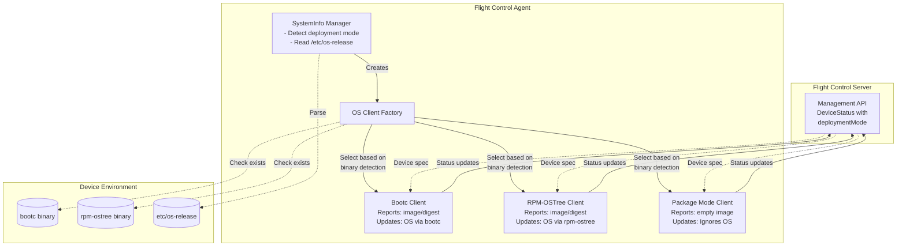
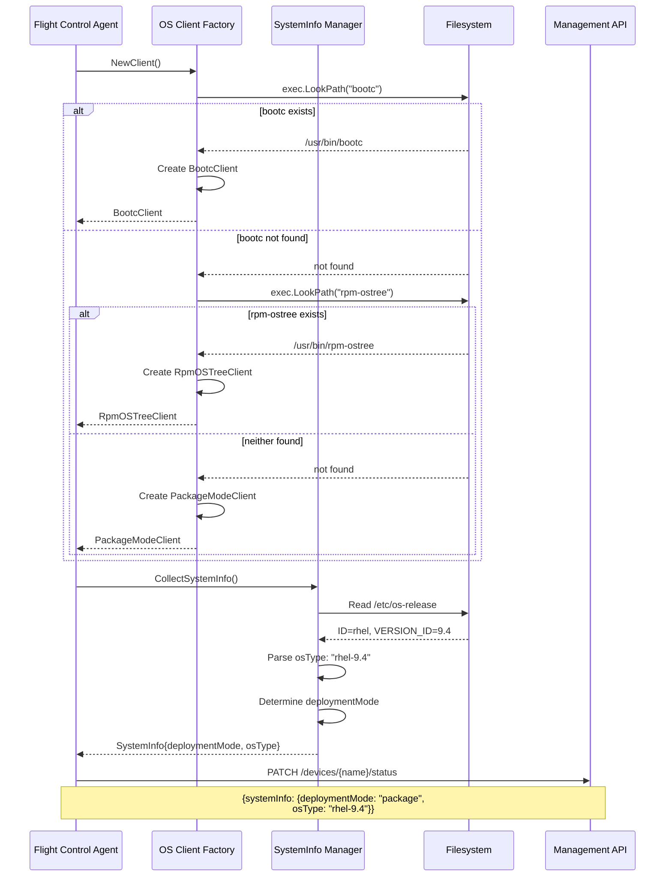
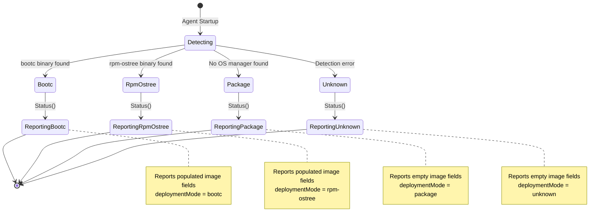
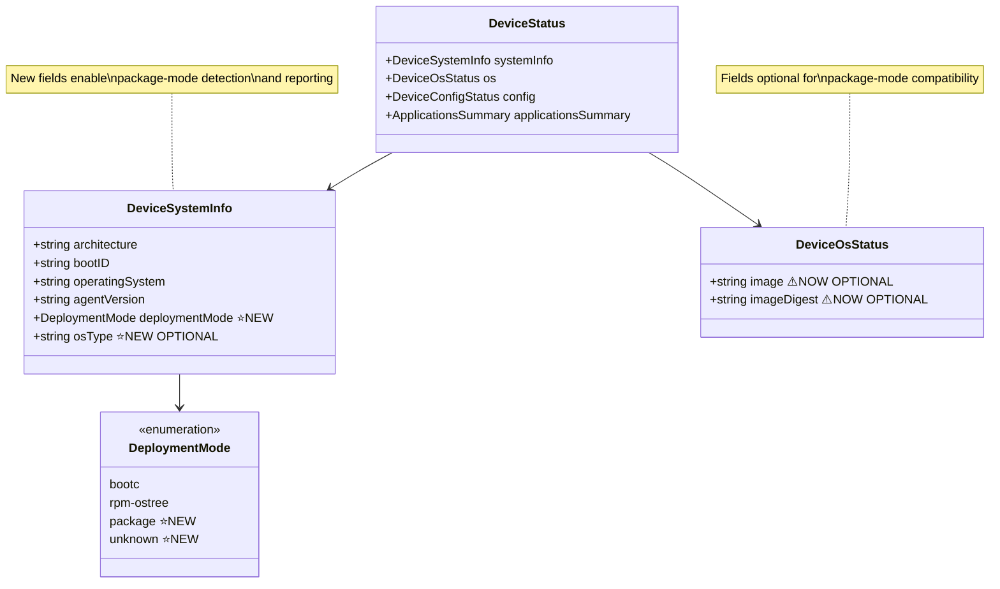
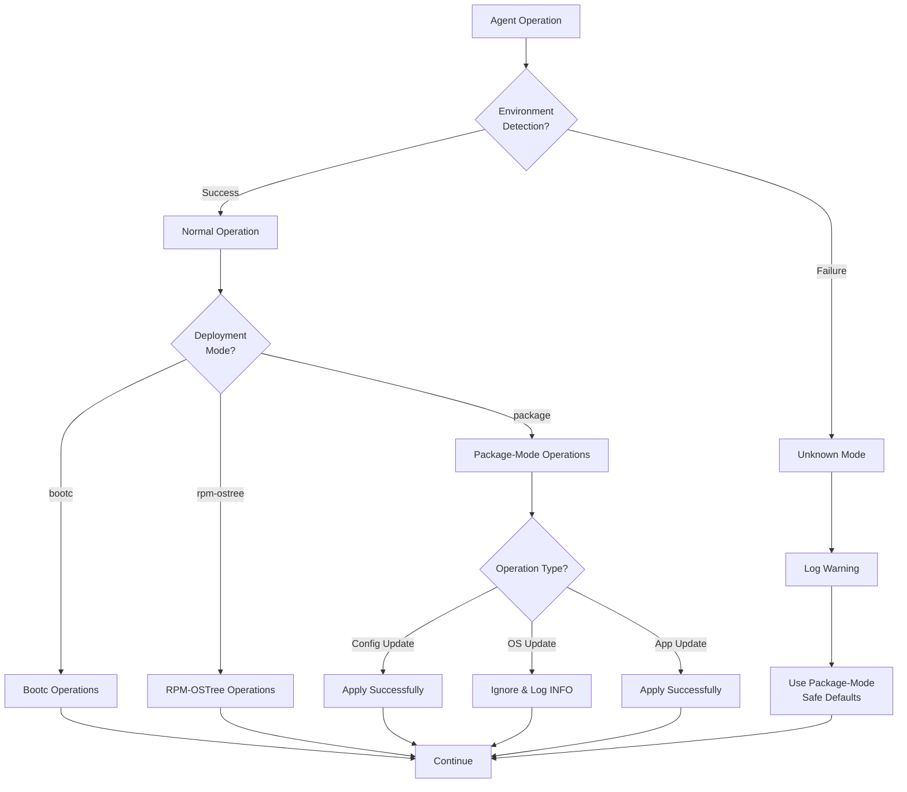
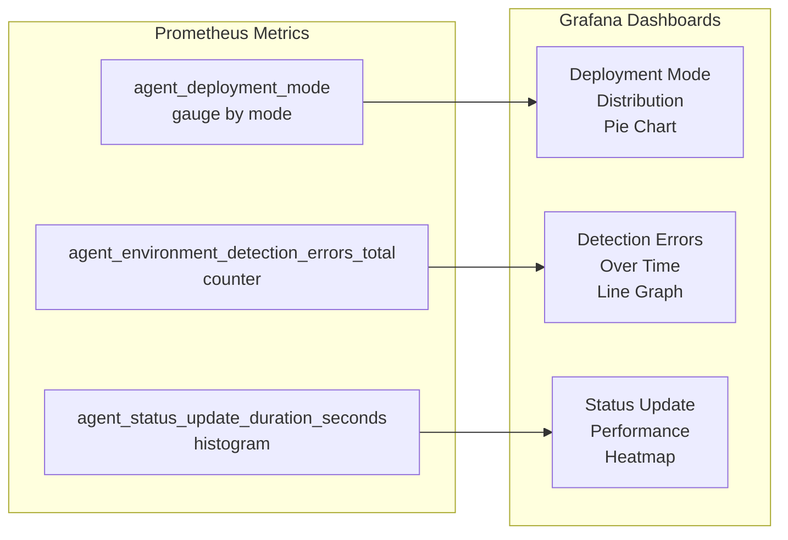
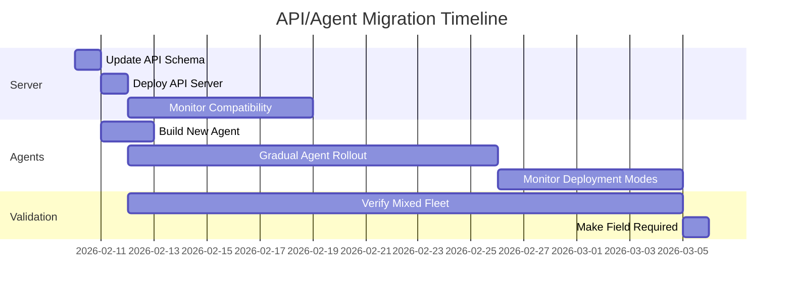

# Non-Image-Mode Device Support

| <!-- -->       | <!-- -->                                              |
| -------------- | ----------------------------------------------------- |
| Author(s):     | Andy Dalton, Anthropic Claude (Planning Agent)        |
| Status:        | Draft                                                 |
| Jira feature:  | [EDM-1471](https://issues.redhat.com/browse/EDM-1471) |
| Branch:        | `andalton/speckit-edm-1471`                           |
| Date:          | 2026-02-03                                            |
| Spec:          | [spec.md](spec.md)                                    |

**Note**: This document was generated by the `/speckit.plan` command.

# 1. Overview

This feature extends Flight Control agent support to traditional package-managed Linux systems (RHEL with dnf/yum, Ubuntu with apt), enabling device enrollment and configuration management without requiring bootc image-based deployments. The agent will detect its deployment environment (image-mode vs package-mode), report deployment mode and OS type through the API, and adapt its behavior to avoid interfering with system package managers.

**Design Assumption**: This plan assumes that mixed-mode fleets (fleets containing both image-mode and package-mode devices) are supported. This assumption is revisited in Section 8 (Open Questions) for stakeholder discussion.

Technical approach: Enhance the existing OS client factory pattern to recognize package-mode environments, extend the DeviceSystemInfo API schema with deployment mode and OS type fields, and ensure the agent gracefully handles OS-level update requests by ignoring them in package-mode.

# 2. Goals and Non-Goals

## 2.1 Goals

* Enable Flight Control agent installation on RHEL 9+ systems managed by dnf/yum (non-bootc)
* Enable Flight Control agent installation on Ubuntu 22.04+ systems managed by apt
* Detect deployment environment automatically (image-mode vs package-mode) on agent startup
* Report deployment mode and OS type through DeviceSystemInfo API field
* Apply configuration updates successfully on package-mode devices without package manager conflicts
* Ignore OS-level package update requests when running in package-mode (log informational message)
* Maintain 100% backward compatibility with bootc/rpm-ostree (image-mode) deployments
* Display deployment mode in Flight Control UI (tracked separately, UI repository)

## 2.2 Non-Goals

* Managing OS-level package updates via Flight Control (remains with system package managers)
* Creating .deb packages for Ubuntu (installation via alternative method acceptable in this phase)
* Supporting Linux distributions beyond RHEL and Ubuntu
* Managing non-Flight Control system services or packages
* Breaking changes to existing Device API or agent behavior

# 3. Motivation / Background

Flight Control currently requires bootc-enabled systems for device management, limiting adoption to organizations with image-based infrastructure. Many enterprises manage edge devices using traditional RHEL (dnf/yum) or Ubuntu (apt) installations and cannot adopt image-based approaches without significant operational changes. This creates a barrier to Flight Control adoption despite strong interest in its configuration management and fleet orchestration capabilities.

The existing agent architecture already includes a "dummy" OS client for unsupported systems, which currently just logs warnings and no-ops all OS operations. This provides a natural extension point: enhance the dummy client to become a full-fledged "package-mode" client that reports deployment mode, handles configuration updates correctly, and explicitly documents its behavior of ignoring OS updates.

By adding environment detection and deployment mode reporting, Flight Control can support package-managed systems while maintaining clarity about what operations are supported in each deployment mode. This enables a heterogeneous device fleet where some devices use image-based updates (bootc) and others use traditional package management, all managed through a single Flight Control instance.

# 4. Design

## 4.1 Architecture

### High-Level Component Interaction

This architecture diagram illustrates how the agent detects its deployment environment and adapts its behavior accordingly. Understanding this component interaction is essential because it shows the decision point where package-mode support diverges from image-mode behavior. The key innovation is enhancing the existing OS client factory pattern to recognize package-managed systems without requiring architectural changes.

**Note**: Diagrams use Mermaid syntax for rendering in documentation tools that support it.



**Key architectural points:**

- **Factory pattern** - Existing OS client factory extended, not replaced
- **Detection method** - Simple binary existence checks (bootc → rpm-ostree → package)
- **Client isolation** - Each OS client type handles its deployment mode independently
- **Status reporting** - All clients report to API via same interface, with package-mode reporting empty OS image fields

### Environment Detection Flow

The agent performs environment detection during startup, executing a series of checks that determine how it will behave for the lifetime of the process. This sequence diagram traces the exact steps from agent startup through API status reporting. Pay close attention to the cascading binary checks (bootc → rpm-ostree → package) and the parallel collection of OS type information from `/etc/os-release`.

**Critical timing note**: This detection happens once at agent startup and the result persists until restart. Understanding this flow is essential for troubleshooting deployment mode misdetection issues.



**What this flow reveals:**

- **Priority order** - bootc checked first, then rpm-ostree, finally package-mode (safe default)
- **Two data sources** - Binary detection (deployment mode) + /etc/os-release (OS type)
- **Single API call** - Both fields reported together in first status update
- **No retries** - Detection is deterministic based on current system state

### Deployment Mode State Machine

This state diagram models how the agent transitions through detection states and what data it reports to the API for each deployment mode. The diagram emphasizes an important architectural decision: **the agent never transitions between deployment modes once detected**—the mode is determined at startup and remains stable.

The nested states show the exact API payload differences between deployment modes, particularly highlighting that package-mode and unknown modes report empty image fields while image-based modes (bootc/rpm-ostree) populate them.



**State transition rules:**

- **One-way transition** - Agent moves from Detecting → Reporting once, never transitions between reporting states
- **Stable mode** - Deployment mode persists for agent lifetime (requires restart to re-detect)
- **Unknown handling** - Detection errors fall back to "unknown" mode with empty image fields (safe default)
- **API contract** - Image fields required for bootc/rpm-ostree, optional for package/unknown

### Component Responsibilities

**SystemInfo Manager** (`internal/agent/device/systeminfo/manager.go`):

- Detects deployment mode by checking for bootc/rpm-ostree binaries
- Parses `/etc/os-release` for OS type (ID and VERSION_ID fields)
- Exports deployment mode and OS type to DeviceStatus.SystemInfo
- Implements `status.Exporter` interface (existing pattern)

**OS Client Factory** (`internal/agent/device/os/client.go`):

- Instantiates appropriate OS client based on environment
- No API changes (existing pattern extended)
- Priority: bootc → rpm-ostree → package-mode

**PackageModeClient** (enhanced from dummy):

- Implements `os.Client` interface
- Status() returns empty BootcHost (no image/digest)
- Switch() logs "Ignoring OS update in package-mode" (INFO level)
- Apply() is no-op (no reboot triggered)

**DeviceStatus API** (`api/core/v1beta1/openapi.yaml`):

- DeviceSystemInfo.deploymentMode: new required field (enum)
- DeviceSystemInfo.osType: new optional field (string)
- DeviceOsStatus: image/imageDigest become optional (empty for package-mode)

## 4.2 Data Model / Schema Changes

See [data-model.md](data-model.md) for complete details.

### Schema Enhancements Diagram

This class diagram illustrates the API schema changes required to support package-mode devices. The additions are intentionally minimal and backward-compatible: two new fields in DeviceSystemInfo and relaxed constraints on DeviceOsStatus. Understanding these changes is critical for API client developers who need to handle both image-mode and package-mode devices in the same fleet.

**Design principle**: Additive changes only—no breaking modifications to existing fields or contracts.



**Schema change highlights:**

- **DeploymentMode enum** - New type with four values (bootc, rpm-ostree, package, unknown)
- **Required field** - deploymentMode added as required to DeviceSystemInfo (validates all agents report mode)
- **Optional field** - osType added to DeviceSystemInfo for distribution/version visibility
- **Relaxed constraints** - DeviceOsStatus.image and imageDigest no longer required (allows empty values for package-mode)

**Summary of Changes**:

1. **DeviceSystemInfo additions**:
   - `deploymentMode`: DeploymentMode enum (required)
   - `osType`: string (optional), format: "{distro}-{version}"

2. **DeploymentMode enum**:
   - Values: "bootc", "rpm-ostree", "package", "unknown"

3. **DeviceOsStatus modifications**:
   - `image`: no longer required (empty string for package-mode)
   - `imageDigest`: no longer required (empty string for package-mode)

**Database Impact**: None. DeviceStatus stored as JSONB; schema additive.

## 4.3 API Changes

**OpenAPI Schema Modifications** (`api/core/v1beta1/openapi.yaml`):

```yaml
# NEW ENUM
DeploymentMode:
  type: string
  enum: ["bootc", "rpm-ostree", "package", "unknown"]

# ENHANCED
DeviceSystemInfo:
  required:
    - architecture
    - bootID
    - operatingSystem
    - agentVersion
    - deploymentMode  # NEW
  properties:
    deploymentMode:
      $ref: '#/components/schemas/DeploymentMode'
    osType:
      type: string  # NEW OPTIONAL

# MODIFIED (required constraint removed)
DeviceOsStatus:
  properties:  # No 'required' array
    image: string
    imageDigest: string
```

**Generated Go Types** (`api/core/v1beta1/types.gen.go`):

- Type `DeploymentMode` with constants
- `DeviceSystemInfo.DeploymentMode` field added
- `DeviceSystemInfo.OsType` optional field added
- `DeviceOsStatus` fields remain strings (not pointers for backward compat)

**API Versioning**:

- No new API version required (additive changes)
- Existing v1beta1 endpoints unchanged
- Clients ignoring new fields remain compatible

## 4.4 Scalability

**Memory Usage**:

- Per-device: +50 bytes (deploymentMode string + osType string)
- 10k devices: +500KB total (negligible)

**CPU Usage**:

- Environment detection: One-time on agent startup (exec.LookPath + /etc/os-release read)
- <1ms additional CPU per agent startup
- No ongoing CPU impact

**Database Load**:

- No schema changes, JSONB accommodates new fields
- Status updates remain same frequency (30s interval)
- Slightly larger JSON payload (+50 bytes per device)

**Network Load**:

- Status update payload: +50 bytes per update
- 10k devices @ 30s intervals: +1.6KB/s total (negligible)

**Data Retention**: No changes (ephemeral status, not historical)

**Future Growth**:

- Schema supports additional deployment modes (add enum value)
- OS type format extensible (freeform string)
- No performance constraints for 100k+ devices

## 4.5 Security Considerations

**Binary Detection** (`exec.LookPath`):

- Risk: PATH manipulation could cause misdetection
- Mitigation: Uses Go's standard exec.LookPath (no shell evaluation)
- Impact: Low (worst case: incorrect mode reported, gracefully handled)

**File Read** (`/etc/os-release`):

- Risk: Malicious os-release content
- Mitigation: Parse only ID and VERSION_ID fields, sanitize input
- Impact: Low (os-release controlled by root, agent runs as root)

**Package Manager Conflicts**:

- Risk: Concurrent dnf/apt operations during agent config updates
- Mitigation: Agent doesn't invoke package managers in package-mode
- Impact: None (agent uses file I/O, not package management)

**Privilege Escalation**:

- Risk: None (agent already requires root, no new privileged operations)
- Mitigation: N/A
- Impact: None

**Data Exposure**:

- Risk: Deployment mode/OS type leaked via API
- Mitigation: Non-sensitive metadata, already exposed via systemInfo
- Impact: None (public device inventory information)

**Authentication/Authorization**:

- No changes (existing device enrollment and RBAC apply)

## 4.6 Failure Handling and Recovery

### Error Scenarios

This decision tree illustrates how the agent handles errors during environment detection and subsequent operations. The key insight is that **package-mode serves as the safe fallback**—when detection fails or the environment is ambiguous, the agent defaults to package-mode behavior (no OS updates, configuration-only management).

The diagram traces three operation types (config updates, OS updates, app updates) to show how package-mode handles each safely without risking conflicts with system package managers.



**Error handling strategy:**

- **Graceful degradation** - Unknown mode falls back to package-mode safe defaults
- **Ignore OS updates** - Package-mode always ignores OS update requests (logged as INFO, not error)
- **Config/app updates succeed** - Only OS management is affected; configuration and application updates work normally
- **No blocking errors** - Detection failures don't prevent agent from starting or functioning

**Environment Detection Failure**:

```text
Scenario: Unable to read /etc/os-release
Behavior: Report deploymentMode="unknown", osType=nil, log warning
Recovery: Agent continues with package-mode behavior (safe default)
```

**Package Manager Lock**:

```text
Scenario: dnf/apt running during agent config update
Behavior: Agent writes files (no package manager invoked), no conflict
Recovery: N/A (agent doesn't use package manager)
```

**API Schema Validation Failure**:

```text
Scenario: Old server rejects deploymentMode field
Behavior: Agent retries, eventually logs error
Recovery: Graceful degradation (status updates fail, but agent continues)
```

**Missing Bootc Binary After Detection**:

```text
Scenario: bootc uninstalled after agent startup
Behavior: Next status.Status() call fails
Recovery: Retry logic in StatusManager handles transient failures
```

**Idempotency**:

- Environment detection is idempotent (pure function of system state)
- Status updates idempotent (same status reported yields same result)
- Configuration updates idempotent (existing behavior)

**Retry Logic**:

- Status updates: Existing retry in StatusManager (up to 60s timeout)
- Environment detection: No retry (one-time on startup)

## 4.7 RBAC / Tenancy

No RBAC changes required.

**Device Visibility**:

- Deployment mode visible to users with device read permissions (existing RBAC)
- Same authorization rules for systemInfo as other DeviceStatus fields

**Filtering/Selection**:

- Future enhancement: Filter devices by deploymentMode in API queries
- Out of scope for this feature (tracked separately)

**Multi-Tenancy**:

- No impact (device ownership unchanged)
- Deployment mode per-device, respects org/fleet boundaries

## 4.8 Extensibility / Future-Proofing

**Additional Deployment Modes**:

- Add enum value to DeploymentMode (e.g., "flatpak", "snap")
- Detection logic in OS client factory extensible

**Additional OS Types**:

- osType is freeform string, supports any distribution
- Parser can be enhanced for complex version schemes

**Migration Support** (future):

- Deployment mode field enables detecting mode changes
- Could trigger alerts on unexpected mode transitions
- Out of scope for this feature

**Metrics/Dashboards**:

- Deployment mode label enables Prometheus queries
- Fleet composition dashboards (% bootc vs package)

# 5. Alternatives Considered

## Alternative 1: Separate Agent Binary for Package Mode

**Description**: Build flightctl-agent-package as distinct binary from flightctl-agent.

**Pros**:

- Clear separation of concerns
- Smaller binary size for package-mode deployments

**Cons**:

- Maintenance burden (two codebases)
- Confusion for operators (which binary to install?)
- Duplicate code (status, config, app management)

**Rejected Because**: Flight Control constitution favors simplicity and avoiding premature abstraction. Single binary with runtime detection is simpler and more maintainable.

## Alternative 2: Feature Flag for Package Mode

**Description**: Add server-side feature flag to enable/disable package-mode support.

**Pros**:

- Gradual rollout control
- Easy rollback if issues found

**Cons**:

- Adds complexity (flag management)
- Doesn't align with client-side environment reality
- Breaks devices if flag toggled unexpectedly

**Rejected Because**: Environment detection is a device-local concern, not a service-level feature. Detection happens at agent startup regardless of server state.

## Alternative 3: Agent Plugin Architecture

**Description**: Make OS management a pluggable system with package-mode as a plugin.

**Pros**:

- Maximum extensibility
- Clean separation

**Cons**:

- Over-engineering for current needs
- Violates "three instances before abstraction" principle
- Increased complexity and testing burden

**Rejected Because**: Current three-client pattern (bootc/rpm-ostree/package) doesn't justify plugin architecture. Constitution principle: avoid premature abstraction.

# 6. Observability and Monitoring

## Metrics (Prometheus)

**New Metrics**:

```promql
# Deployment mode distribution
agent_deployment_mode{mode="bootc"|"rpm-ostree"|"package"|"unknown"} gauge

# Environment detection errors
agent_environment_detection_errors_total counter
```

**Existing Metrics (no changes)**:

- `agent_status_update_duration_seconds`: Histogram (existing)
- `agent_status_update_errors_total`: Counter (existing)

### Metrics Dashboard Concept

This diagram shows how the new `agent_deployment_mode` metric integrates with existing agent metrics to provide observability into fleet composition. Understanding deployment mode distribution is critical for capacity planning, troubleshooting, and identifying devices that may need attention (e.g., high "unknown" count indicates detection issues).

**Monitoring use case**: Operations teams can use the Deployment Mode Distribution dashboard to quickly assess the mix of image-mode vs package-mode devices and identify anomalies.



## Logging

**New Log Messages**:

```text
INFO  Detected deployment mode: package
INFO  OS type detected: rhel-9.4
INFO  Ignoring OS update in package-mode: quay.io/...
WARN  Unable to read /etc/os-release, deployment mode: unknown
ERROR Failed to detect deployment mode: <error details>
```

**Log Levels**:

- INFO: Normal operation (mode detection, OS updates ignored)
- WARN: Degraded state (os-release missing, unknown mode)
- ERROR: Detection failures

## Alerts

**Recommended Alerts** (Prometheus Alertmanager):

```yaml
# High proportion of unknown deployment modes
- alert: HighUnknownDeploymentMode
  expr: |
    sum(agent_deployment_mode{mode="unknown"}) /
    sum(agent_deployment_mode) > 0.1
  for: 5m
  annotations:
    summary: "More than 10% devices report unknown deployment mode"

# Environment detection errors
- alert: EnvironmentDetectionErrors
  expr: rate(agent_environment_detection_errors_total[5m]) > 0.1
  for: 5m
  annotations:
    summary: "Frequent environment detection errors"
```

# 7. Impact and Compatibility

## Backward Compatibility

**API Compatibility**:

- ✅ Additive schema changes (new optional/required fields)
- ✅ Old clients ignore new fields (JSON gracefully handles extra properties)
- ✅ New agents backward compatible with old servers (extra fields ignored)
- ⚠️ Validation: Old servers may reject deploymentMode if strict validation enabled
  - Mitigation: Server updated first, validation relaxed during transition

**Agent Compatibility**:

- ✅ Old agents continue reporting existing systemInfo fields
- ✅ New agents report additional fields (deploymentMode, osType)
- ✅ No breaking changes to agent configuration format
- ✅ Existing bootc/rpm-ostree behavior unchanged

**Database Migrations**:

- ✅ No schema migrations required (JSONB accommodates new fields)
- ✅ Existing device records compatible (NULL/missing fields valid)

## Migration Path

This timeline visualizes the phased rollout strategy that enables gradual adoption without requiring a coordinated "flag day." The overlapping phases demonstrate how old and new agents can coexist during the transition period, with the server supporting both schema versions simultaneously.

**Critical observation**: The 21-day "Verify Mixed Fleet" phase provides ample time to identify and resolve compatibility issues before making the deploymentMode field strictly required.



### Phase 1: Server Update

1. Deploy API server with updated OpenAPI schema
2. Accept but don't require deploymentMode field
3. Existing agents continue working (old schema)

### Phase 2: Agent Rollout

1. Deploy new agents progressively (report deployment mode)
2. Monitor agent_deployment_mode metric for coverage
3. Old agents coexist with new agents (mixed fleet)

### Phase 3: Enforcement (future, optional)

1. Make deploymentMode required in API validation
2. Deprecate old agents (after 99% updated)

**No flag day required**: Gradual rollout supported.

# 8. Open Questions

* **Q1**: Should Ubuntu support use .deb packages or alternative installation method (e.g., tarball)?
  * **Impact**: Installation instructions and packaging complexity
  * **Decision needed by**: Implementation start
  * **Recommendation**: Use tarball + systemd unit for MVP, .deb in future release

* **Q2**: What is acceptable threshold for "unknown" deployment mode in production?
  * **Impact**: Alert tuning, monitoring thresholds
  * **Decision needed by**: E2E testing phase
  * **Recommendation**: <5% unknown, alert if >10% for 5m

* **Q3**: Should deployment mode be immutable (device cannot change modes)?
  * **Impact**: Error handling, UI display
  * **Decision needed by**: Design review
  * **Recommendation**: Allow changes but log warning (mode transitions are valid but rare)

* **Q4**: Should API support filtering devices by deploymentMode?
  * **Impact**: API query complexity, UI filtering features
  * **Decision needed by**: Post-MVP (track separately)
  * **Recommendation**: Out of scope for EDM-1471, track as enhancement

## Mixed Device Fleets

**Question**: Should a single Flight Control fleet support both image-mode and package-mode devices simultaneously?

**Current Plan Assumption**: Section 1 assumes mixed-mode fleets are supported. This assumption appears throughout the plan (Appendix A scale requirements, Appendix B constitution checklist, spec.md user stories).

**Arguments For**:
- Operational flexibility: Organizations can manage heterogeneous environments in a unified way
- Migration support: Enables gradual transitions between deployment models within a fleet
- Real-world scenarios: Many organizations have mixed infrastructure and want unified management
- Simpler mental model: Operators don't need to think about fleet-level deployment mode constraints

**Arguments Against (Potential Footguns)**:
- Configuration complexity: Fleet-level policies may not apply cleanly to both modes (e.g., OS update policies meaningless for package-mode)
- Update semantics differ: Image-mode uses atomic updates; package-mode uses incremental updates. Same configuration could behave differently.
- Operator confusion: Different devices in the same fleet behaving differently could be surprising and lead to misdiagnosis
- Testing burden: Every fleet-level feature must be validated against both modes, doubling test matrix
- API validation complexity: Hard to enforce mode-specific constraints at the fleet level

**Decision Required**:
- If mixed fleets are **allowed**: Current plan proceeds as-is
- If mixed fleets are **prohibited**: Need API validation to prevent assigning incompatible devices to the same fleet, documentation updates, and removal of mixed-mode test scenarios (Appendix B)

**Impact if Decision Changes**: Medium. Would require removing mixed-mode assumptions from testing strategy, potentially adding fleet-level deployment mode field, and updating user stories.

## Unknown Deployment Mode Handling

**Question**: Should users ever see an "unknown" deployment mode, or should this always result in an error state that blocks device operation?

**Current Plan Position**:
- FR-015 (spec.md:104): Agent reports an error state internally rather than making assumptions
- Section 4.1: "Unknown" is a valid state in the deployment mode state machine
- Section 4.6: Unknown mode falls back to package-mode safe defaults

**Clarification**: The "unknown" state is an **internal error-handling mechanism**, not a third deployment mode option for users to select. It occurs when environment detection fails (e.g., corrupted /etc/os-release, ambiguous binary detection).

**Options**:
1. **Expose "unknown" in UI** (current plan): Users see devices in unknown state, can investigate/troubleshoot
   - Pro: Transparency, enables debugging
   - Con: May confuse users, looks like a supported mode
2. **Block enrollment/operation**: Devices in unknown state cannot enroll or report status
   - Pro: Forces resolution before device is managed
   - Con: May be too strict for edge cases, reduces availability
3. **Hide from users, log internally**: UI shows "error" instead of "unknown mode"
   - Pro: Clearer UX (error vs mode)
   - Con: Less transparency for troubleshooting

**Decision Needed**: Which option aligns with Flight Control's error handling philosophy?

**Recommendation**: Option 1 (expose as unknown) with clear documentation that this is an error state requiring investigation, not a supported deployment mode. Add troubleshooting guide for resolving unknown states.

---

# Appendix A: Technical Context

**Language/Version**: Go 1.24.0 (with FIPS-validated toolset when available)

**Primary Dependencies**:

- github.com/coreos/rpmostree-client-go v0.0.0-20240514234259-72a33e8554b6 (existing)
- github.com/flightctl/flightctl/internal/container (bootc client)
- github.com/flightctl/flightctl/pkg/executer (command execution interface)
- Standard library: os/exec, runtime, os (file I/O)

**Storage**:

- PostgreSQL (device status persisted as JSONB via management API)
- Local filesystem (/etc/flightctl/, /var/lib/flightctl/ for agent state)

**Testing**:

- Unit: `go test` with go.uber.org/mock v0.4.0 for interface mocking
- Integration: test/integration/agent/ (existing patterns)
- E2E: test/e2e/agent/ with VM harness (requires enhancement for non-bootc VMs)

**Target Platform**:

- RHEL 9+ (both bootc and traditional installations via dnf/yum)
- Ubuntu 22.04+ LTS (traditional installations via apt)
- Linux kernel 5.x+ with systemd

**Project Type**: Single project (standard Flight Control internal/pkg/api/test structure)

**Performance Goals**:

- Environment detection: <100ms on agent startup
- Status collection: <5s (no degradation vs image-mode)
- API status updates: <1s response time

**Constraints**:

- Zero interference with system package managers (dnf/apt/yum)
- 100% backward compatibility with bootc/rpm-ostree deployments
- No coordinated flag-day for server/agent deployment (additive API changes)
- Agent must handle missing OS manager binaries gracefully

**Scale/Scope**:

- Support 1000s of devices per Flight Control deployment
- Mixed device fleets (image-mode + package-mode in same fleet)
- Device status updates every 30s (existing agent sync interval)

# Appendix B: Constitution Check

*GATE: Must pass before Phase 0 research. Re-check after Phase 1 design.*

Verify compliance with Flight Control Constitution (v1.0.0):

## I. Test-First Development

- [x] TDD approach documented: Tests written before implementation (see Section 4.6)
- [x] Test approval process defined: Test files in contracts/ for review before coding begins
- [x] Contract tests identified for:
  - Agent environment detection (bootc/rpm-ostree/package)
  - API schema validation (DeviceSystemInfo with deploymentMode field)
  - OS status reporting (empty vs populated image/digest)
- [x] Integration tests scoped for:
  - Package-mode configuration updates (verify no package manager conflicts)
  - Image-mode regression suite (ensure bootc behavior unchanged)
  - Mixed-mode fleet operations

## II. Code Quality & Standards

- [x] Linting verified: `make lint` passes on feature branch (pre-commit requirement)
- [x] Go best practices confirmed:
  - Error handling: All exec.LookPath() and file I/O checked
  - Import ordering: standard → third-party → local per project convention
  - Security: No command injection (using executer.Executer abstraction), file read uses ioutil patterns
- [x] Interface changes inventoried:
  - `os.Client` interface: No changes (existing dummy client becomes package-mode client)
  - `status.Exporter` interface: No changes (OS manager already implements)
  - `systeminfo.Manager`: Add deployment mode detection (backward compatible)
- [x] Documentation plan:
  - "Why" comments for deployment mode detection logic
  - Package-mode behavior rationale in os/client.go

## III. Observability

- [x] Structured logging plan:
  - State transitions: "Detected package-mode environment", "Ignoring OS update in package-mode"
  - Request tracing: Agent status sync includes deploymentMode in logs
  - No sensitive data: OS type and deployment mode are non-sensitive metadata
- [x] Metrics plan:
  - Request rates: Existing agent status update metrics (no new metrics needed)
  - Error rates: Track environment detection failures (counter: agent_environment_detection_errors_total)
  - Business metrics: Devices by deployment mode (gauge: agent_deployment_mode, labels: mode={bootc,rpm-ostree,package,unknown})
- [x] Tracing plan:
  - Critical paths: Agent enrollment flow includes deployment mode in trace attributes
  - Not adding new distributed traces (agent→server already traced)

**Complexity Justifications**: NONE. This feature follows existing patterns and introduces no new abstractions.

# Appendix C: Project Structure

## Documentation (this feature)

```text
specs/EDM-1471/
├── spec.md              # Feature specification (/speckit.specify output)
├── plan.md              # This file (/speckit.plan output)
├── research.md          # Technical research findings
├── data-model.md        # Schema and entity details
├── quickstart.md        # Developer setup guide
├── contracts/           # API contract definitions
│   ├── api-device-status.yaml
│   └── agent-environment-detection.md
├── checklists/          # Quality validation
│   └── requirements.md  # Spec quality checklist
└── tasks.md             # Implementation tasks (/speckit.tasks - NOT YET CREATED)
```

## Source Code (repository root)

```text
# Agent Components
internal/agent/
├── device/
│   ├── os/
│   │   ├── client.go           # MODIFY: Rename dummy→package-mode
│   │   ├── client_test.go      # ADD: Package-mode client tests
│   │   ├── os.go               # MODIFY: Handle empty image gracefully
│   │   └── mock_os.go          # REGENERATE: Update mocks
│   ├── systeminfo/
│   │   ├── manager.go          # MODIFY: Add deployment mode detection
│   │   ├── manager_test.go     # ADD: Detection tests
│   │   ├── system_info.go      # MODIFY: Parse /etc/os-release for osType
│   │   └── system_info_test.go # ADD: OS type parsing tests
│   └── status/
│       └── status.go           # NO CHANGE: Existing exporter pattern

# API Schema
api/core/v1beta1/
├── openapi.yaml          # MODIFY: Add DeploymentMode enum, update schemas
├── types.gen.go          # REGENERATE: After OpenAPI changes
└── types.gen.cfg         # NO CHANGE: Generation config

# Tests
test/
├── integration/agent/
│   └── environment_detection_test.go  # ADD: Integration tests
├── e2e/agent/
│   ├── agent_package_mode_test.go     # ADD: E2E tests for package-mode
│   └── agent_update_test.go           # MODIFY: Add regression tests
└── harness/e2e/
    ├── vm_pool.go                     # MODIFY: Support non-bootc VMs
    └── harness_device.go              # MODIFY: Handle package-mode devices

# Documentation
docs/user/
├── installing/
│   └── installing-agent-package-mode.md  # ADD: Installation guide
└── using/
    └── managing-devices.md               # MODIFY: Add deployment mode info
```

**Structure Decision**: Using single project structure (default for Flight Control). All components under internal/, API definitions in api/, tests in test/. No new top-level directories required; feature integrates into existing architecture.
